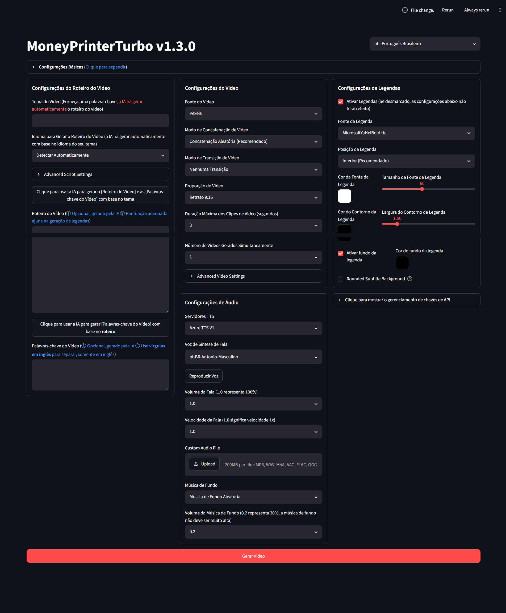

<div align="center">
<h1 align="center">MoneyPrinterTurbo 💸</h1>

<p align="center">
  <a href="https://github.com/harry0703/MoneyPrinterTurbo/stargazers"></a>
  <a href="https://github.com/harry0703/MoneyPrinterTurbo/issues"></a>
  <a href="https://github.com/harry0703/MoneyPrinterTurbo/network/members"></a>
  <a href="https://github.com/harry0703/MoneyPrinterTurbo/blob/main/LICENSE"></a>
</p>
<br>
<h3>Português Brasileiro | <a href="README-zh.md">简体中文</a> | <a href="README-en.md">English</a> | <a href="README-ar.md">العربية</a></h3>
</div>

<br>
Basta fornecer um <b>tema</b> ou <b>palavra-chave</b> para o vídeo, e o sistema gerará automaticamente o roteiro, os materiais de vídeo, as legendas e a música de fundo antes de sintetizar um vídeo curto em alta definição.
<br>

<p align="center">
  <sub>
    Agradecemos à <a href="https://aihubmix.com/?aff=CEve">AIHubMix</a> pelo patrocínio a este projeto. A AIHubMix é profundamente compatível com os principais modelos do mundo, como OpenAI, Claude, Gemini, DeepSeek, Zhipu, Qwen, etc., oferecendo acesso rápido a mais de 700 modelos (incluindo vários modelos gratuitos) com estabilidade de nível empresarial.
  </sub>
</p>

<h4>Interface Web (WebUI)</h4>



<h4>Interface de API</h4>


</div>

## Funcionalidades 🎯

- [x] Arquitetura **MVC completa**, código com **estrutura limpa**, fácil de manter, suportando `API` e `Interface Web`
- [x] Suporte para **geração automática de roteiro de vídeo por IA**, bem como **roteiros personalizados**
- [x] Suporte a múltiplos tamanhos de **vídeo em alta definição**:
  - [x] Retrato 9:16 (`1080x1920`)
  - [x] Paisagem 16:9 (`1920x1080`)
- [x] Suporte para **geração de vídeos em lote**, permitindo gerar vários de uma vez e escolher o melhor
- [x] Suporte para configuração de **duração máxima dos clipes**, facilitando o ajuste da frequência de transição
- [x] Suporte para roteiros em **vários idiomas**, incluindo Português, Inglês e Chinês
- [x] Suporte para **síntese de voz múltipla**, com **demonstração em tempo real**
- [x] Suporte para **geração de legendas**, com controle de `fonte`, `posição`, `cor`, `tamanho` e `contorno (stroke)`
- [x] Suporte para **música de fundo**, música aleatória ou arquivo de música especificado, com ajuste de volume
- [x] Materiais de vídeo de **alta definição** e **livres de direitos autorais**, ou uso de **materiais locais**
- [x] Integração com múltiplos provedores de vídeo: **Pexels**, **Pixabay**, **Coverr**
- [x] Integração com múltiplos modelos de IA: **OpenAI**, **AIHubMix**, **Moonshot**, **Azure**, **gpt4free**, **one-api**, **Qwen**, **Google Gemini**, **Ollama**, **DeepSeek**, **MiniMax**, **Pollinations**, **ModelScope**, etc.

---

## Demonstração em Vídeo 📺

### Retrato 9:16

<table>
<thead>
<tr>
<th align="center">▶️ 《Como Aumentar a Diversão na Vida》</th>
<th align="center">▶️ 《O Papel do Dinheiro》</th>
<th align="center">▶️ 《Qual o Sentido da Vida?》</th>
</tr>
</thead>
<tbody>
<tr>
<td align="center"><video src="https://github.com/harry0703/MoneyPrinterTurbo/assets/4928832/a84d33d5-27a2-4aba-8fd0-9fb2bd91c6a6"></video></td>
<td align="center"><video src="https://github.com/harry0703/MoneyPrinterTurbo/assets/4928832/af2f3b0b-002e-49fe-b161-18ba91c055e8"></video></td>
<td align="center"><video src="https://github.com/harry0703/MoneyPrinterTurbo/assets/4928832/112c9564-d52b-4472-99ad-970b75f66476"></video></td>
</tr>
</tbody>
</table>

---

## Requisitos de Sistema 📦

- **SO Recomendado**: Windows 10/11, macOS 11.0+ ou distribuições Linux populares.
- GPU dedicada não é obrigatória, mas recomendada se você for realizar transcrição local (Whisper) ou quiser renderização mais rápida.

| Componente | Requisito Mínimo | Recomendado | Ideal |
| --- | --- | --- | --- |
| **CPU** | 4 Cores | 6 a 8 Cores | 8+ Cores |
| **RAM** | 4 GB | 8 GB | 16+ GB |
| **GPU** | Não obrigatório | 4 GB+ VRAM | 8 GB+ VRAM |

---

## Instalação e Implantação 🚀

### Passo 1: Clonar o Código
```shell
git clone https://github.com/harry0703/MoneyPrinterTurbo.git
cd MoneyPrinterTurbo
```

### Passo 2: Configuração
1. Faça uma cópia do arquivo `config.example.toml` e nomeie-a como `config.toml`.
2. Edite o arquivo `config.toml` para inserir suas chaves de API para os provedores de IA (por exemplo, `openai_api_key` ou `aihubmix_api_key`) e provedores de vídeo (Pexels, Pixabay, etc.).
3. *Nota*: O idioma da interface padrão já está configurado para Português Brasileiro (`"pt"`).

---

### Opção A: Implantação com Docker 🐳

Certifique-se de ter o Docker e Docker Compose instalados.

```shell
docker compose up
```

Após iniciar os contêineres:
- **Interface Web**: Acesse http://127.0.0.1:8501 no seu navegador.
- **Documentação da API**: Acesse http://127.0.0.1:8080/docs ou http://127.0.0.1:8080/redoc.

---

### Opção B: Implantação Manual 📦

Recomendamos usar o [uv](https://docs.astral.sh/uv/) para gerenciar o ambiente Python e as dependências (Python 3.11 é recomendado).

```shell
# Instalar Python 3.11 e sincronizar dependências
uv python install 3.11
uv sync --frozen
```

Caso prefira o `venv` tradicional com `pip`:
```shell
python -m venv .venv
# Ativar ambiente virtual (Windows)
.venv\Scripts\activate
# Ativar ambiente virtual (macOS/Linux)
source .venv/bin/activate

pip install -r requirements.txt
```

#### 1. Iniciar Interface Web (WebUI) 🌐

Execute o seguinte comando no diretório raiz do projeto:

**Windows**:
```powershell
.\webui.bat
```

**macOS / Linux**:
```shell
uv run streamlit run ./webui/Main.py --browser.gatherUsageStats=False
```

O navegador abrirá automaticamente a interface. Se abrir uma página em branco, use o Chrome ou Edge.

#### 2. Iniciar Serviço de API 🚀
```shell
uv run python main.py
```
ou
```shell
python main.py
```

---

## Legendas e Transcrição 📜

O projeto suporta dois provedores de legenda (`subtitle_provider` no `config.toml`):
- **edge**: Usa as marcações temporais gratuitas do Edge TTS. É rápido e não requer GPU ou downloads grandes, porém pode ser ligeiramente impreciso em frases muito longas ou complexas.
- **whisper**: Usa o modelo local `faster-whisper`. É extremamente preciso, mas requer download do modelo (~3GB para `large-v3` ou ~250MB para `large-v3-turbo`) e processamento local mais intenso.

---

## Música de Fundo e Fontes 🎵🅰

- **Músicas**: Ficam salvas em `resource/songs/`. O projeto já vem com algumas músicas livres de direitos autorais para teste.
- **Fontes**: Ficam salvas em `resource/fonts/`. Você pode adicionar seus próprios arquivos `.ttf` ou `.ttc` para mudar o estilo da legenda.

---

## Licença MIT 📝

Este projeto é disponibilizado sob a licença MIT. De acordo com os termos da licença, o aviso de direitos autorais original deve ser mantido em todas as cópias ou partes substanciais do software. Consulte o arquivo [LICENSE](LICENSE) para obter o texto completo da licença.
